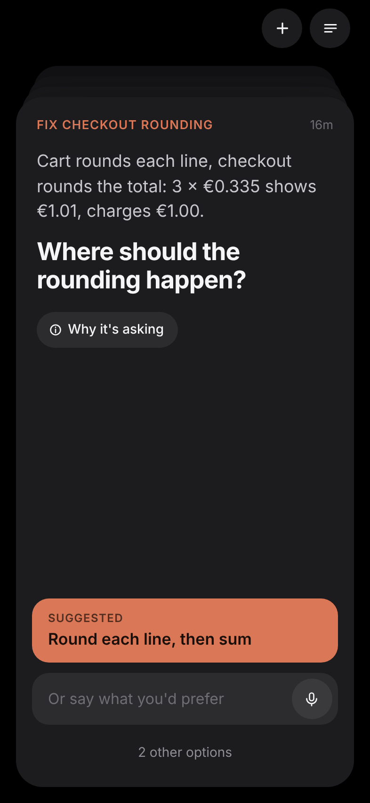
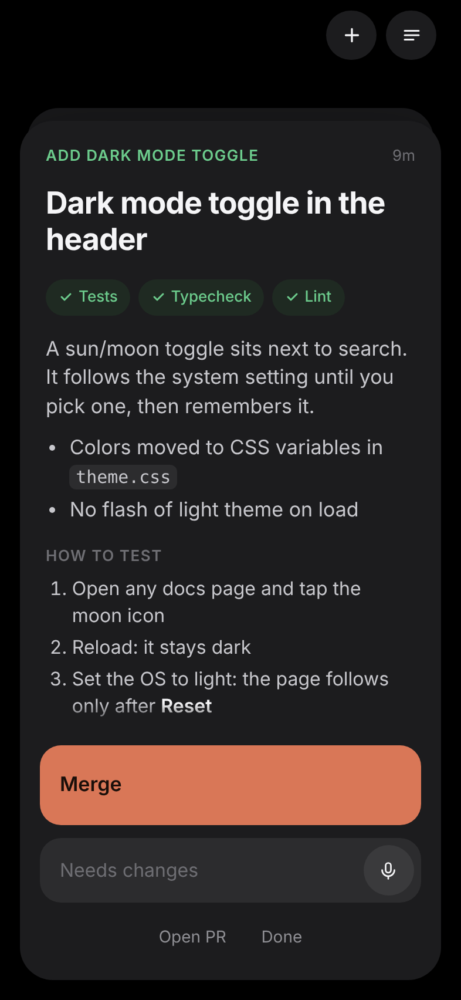
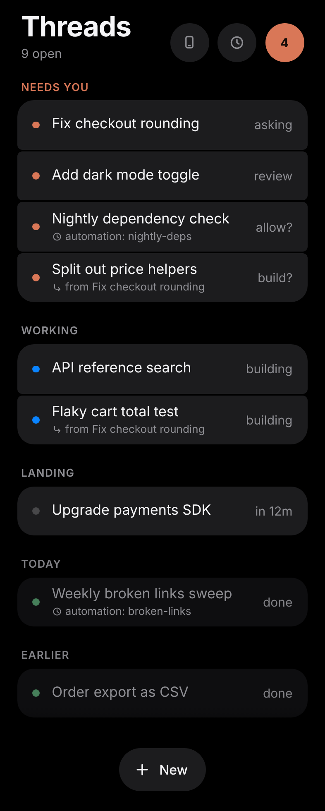
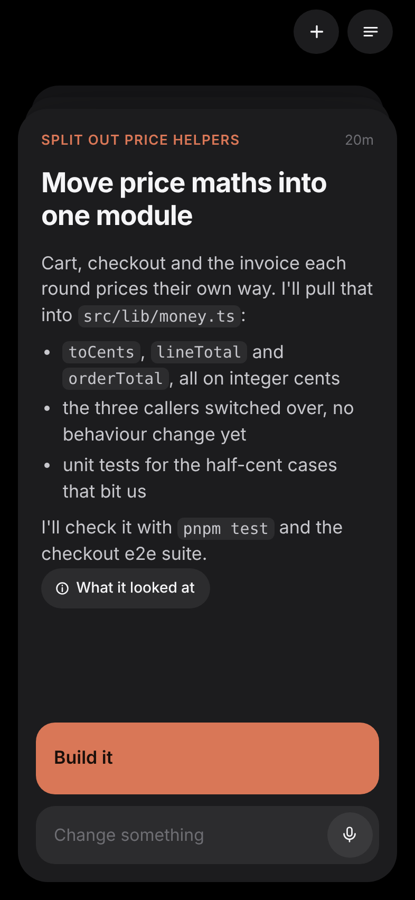
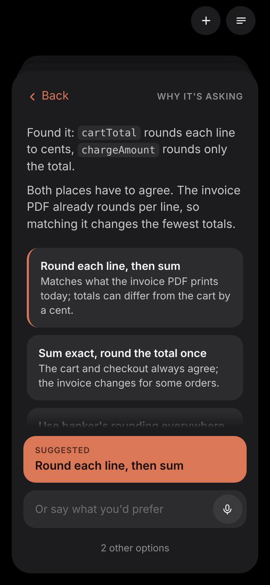

<p align="center">
  
</p>

<h1 align="center">Tenzo</h1>

<p align="center"><b>Many coding agents working on your machine. One thing in your hands.</b></p>

<p align="center">
  
  &nbsp;
  
  &nbsp;
  
</p>

Tenzo runs long-lived Claude Code threads on your computer, each in its own git worktree, and shows you **one card at a time** when a thread needs you: a question, a plan to approve, finished work to look at, a PR ready to merge. You answer from your phone or any browser, and go back to what you were doing.

Self-hosted and open source. No accounts and no cloud of ours: your agents, your logins, your network.

## How it works

1. **You say what you want.** Tenzo cuts a worktree and branch for the thread and runs your own `claude` there, with everything your terminal has: settings, `CLAUDE.md`, skills, subagents, hooks, MCP servers, plugins.
2. **The agent talks before it codes.** It reads the repo, asks only what would change the outcome, then proposes. Nothing is edited until you tap **Build it**.
3. **One card at a time.** Questions, permission prompts and proposals land on **the Pass**, a pile of cards. Tap the suggested answer, type or dictate your own, or swipe to snooze it for 15 minutes.
4. **Finished work comes back as a card**: a handoff note, check badges, screenshots and a live link to the app it built.
5. **Nothing lands without you.** *Merge* has the agent open the PR, wait for CI and reviewers, fix their comments and merge. *Open PR* stops short of merging. *Needs changes* sends your note back.
6. **Automations** start threads on a schedule (a nightly dependency check, a PR reviewer), each run on a budget.

<p align="center">
  
  &nbsp;
  
</p>

The name is the head cook of a Zen monastery: Dōgen's *Instructions for the Cook* is about whole attention to the one task in your hands while a whole kitchen simmers around you. The Pass is the counter every plate crosses before it leaves the kitchen.

## Get started

You need a Mac (Linux works too, without `tenzo service`), Node 22.18+, pnpm 10, git 2.38+ and Claude Code, signed in.

```bash
git clone https://github.com/clawdude/tenzo && cd tenzo
pnpm install && pnpm build
pnpm tenzo project add ~/code/app    # any git repo of yours
pnpm tenzo serve                     # then open http://127.0.0.1:4780
```

Start a thread with the **+** on the page, or from the terminal:

```bash
pnpm tenzo thread start app "The checkout total rounds wrong for 3 items at 9.99"
```

To keep the daemon running across logins and crashes on a Mac, `pnpm tenzo service install`.

## On your phone

Tenzo listens on your machine only. Put [Tailscale Serve](https://tailscale.com/kb/1312/serve) in front of it and pair the phone with a one-time QR code; this command sets it up, asking before it changes anything:

```bash
pnpm tenzo pair --tailscale --name "My iPhone"
```

Add Tenzo to the home screen and turn on notifications to hear when a thread needs you. The whole setup is in [docs/REMOTE.md](docs/REMOTE.md).

## Configure a project

Optional. `.tenzo/config.json` in the repo picks models per phase, the landing rule and automations:

```json
{
  "models": {
    "discuss": { "model": "opus", "thinking": "high" },
    "build": { "model": "sonnet" }
  },
  "landing": "pr",
  "automations": {
    "deps": { "prompt": "Check for outdated dependencies and propose upgrades.", "trigger": { "schedule": "weekdays 09:00" } }
  }
}
```

Every key, environment variable and command is in the [guide](docs/GUIDE.md); `pnpm tenzo --help` lists the commands.

## Status

Milestones M1–M4 are built: Claude Code threads, the whole card set, project config and automations, remote access with pairing and Web Push. The Codex adapter is deferred. See the [roadmap](docs/ROADMAP.md).

## Learn more

- [Guide](docs/GUIDE.md): running the daemon, the CLI, project config, automations, upgrading
- [Remote access](docs/REMOTE.md): your phone over Tailscale, pairing, notifications
- [Product](docs/PRODUCT.md): what Tenzo is, the opinions it enforces, the MVP scope
- [Architecture](docs/ARCHITECTURE.md): how it is built, and why
- [Contributing](CONTRIBUTING.md): developing, checks, and how work is done here
